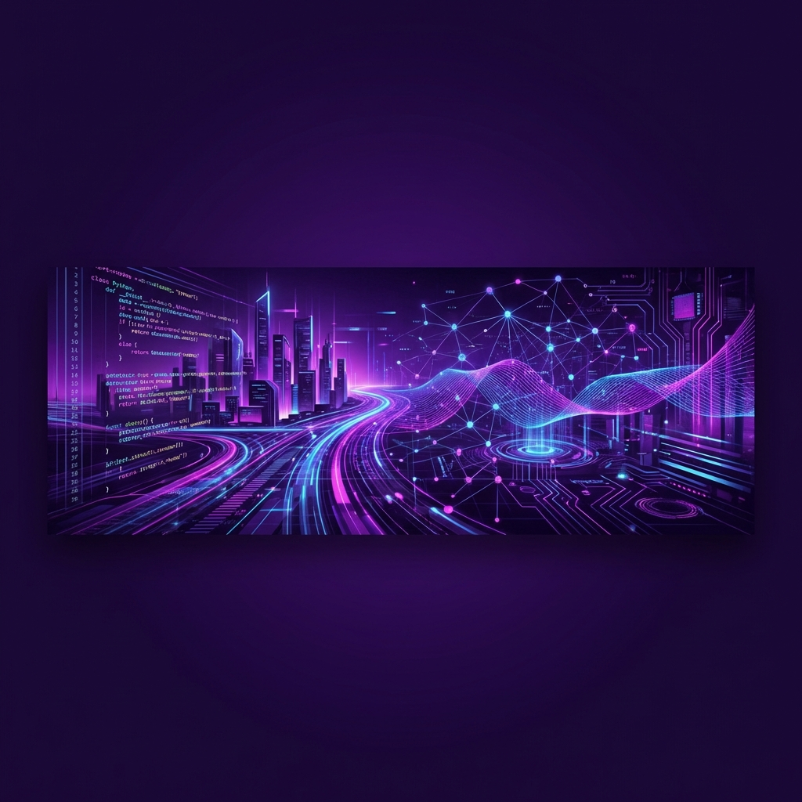

<table align="center">
    <tr>
        <td valign="top" width="50%">
            <h2>🦄 About Me</h2>
             
            
I am a passionate developer interested in <b>Data Science</b> and <b>Machine Learning</b>. I love building projects that solve real-world problems.

            
I am a passionate <b>Backend Developer</b> specializing in the <b>Java Ecosystem</b>. I build secure, scalable microservices and robust enterprise applications.

             
            

                🔭 I’m currently working on <b>Spring Boot Microservices</b> 
                🌱 I’m mastering <b>Spring Security & Cloud Architecture</b> 
                💬 Ask me about <b>Java, API Design, System Architecture</b> 
                📫 Contact: <b>6385393883</b>
            

             
            

                
                
                
            

        </td>
        <td valign="top" width="50%">
            

                <h2>📊 GitHub Stats</h2>
                
                 
                
            

        </td>
    </tr>
</table>

    <h2>🛠️ My Tech Stack</h2>
    
    
    
    
    
    

 

    <h2>🐍 Contributions</h2>
    <picture>
        <source media="(prefers-color-scheme: dark)" srcset="https://github.com/sujan58/profile_repo/blob/output/github-contribution-grid-snake-dark.svg">
        <source media="(prefers-color-scheme: light)" srcset="https://github.com/sujan58/profile_repo/blob/output/github-contribution-grid-snake.svg">
        
    </picture>

 

    

